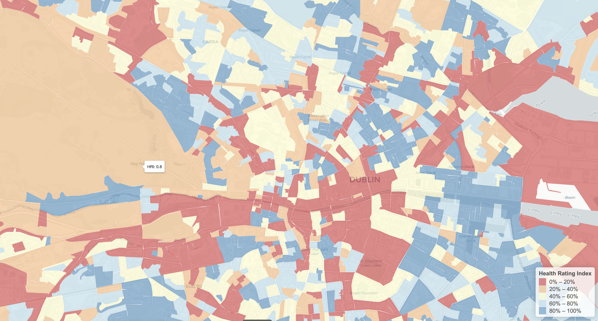
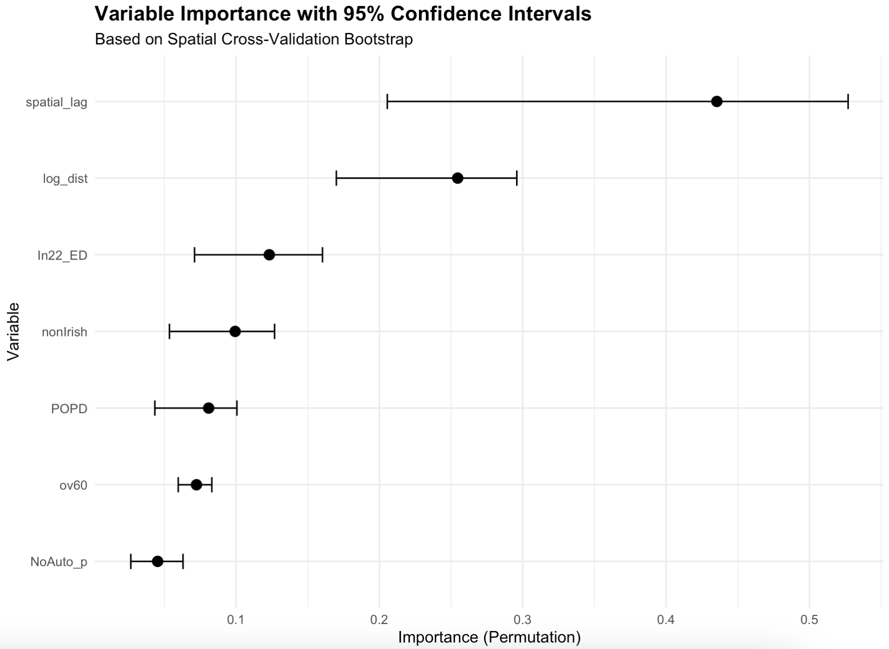
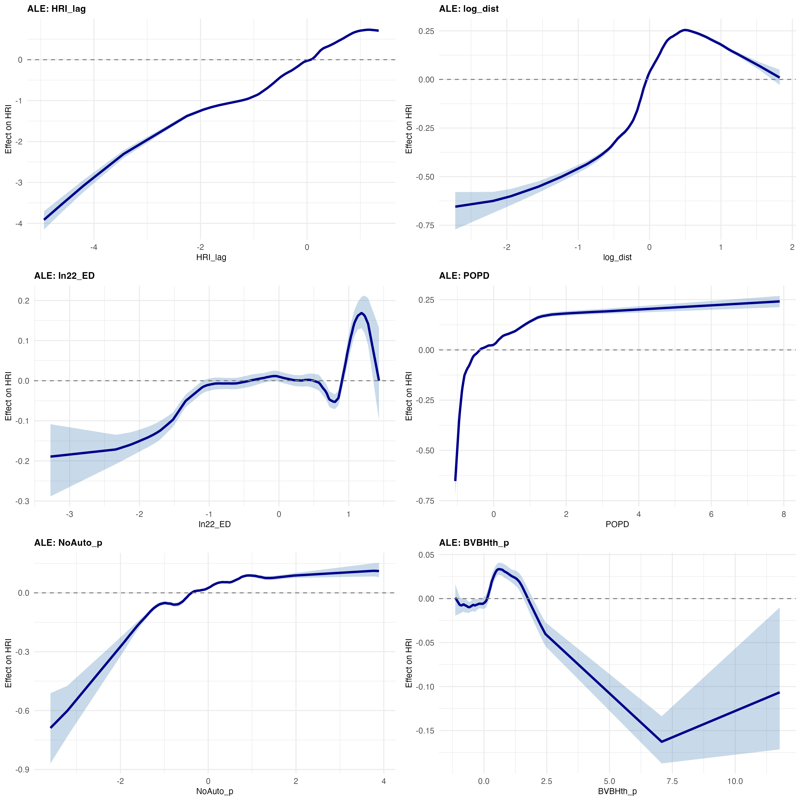

# Health Rating Index for Dublin, Ireland

[](https://doi.org/10.5281/zenodo.15183740)

This repository provides a comprehensive analysis of environmental health burdens and benefits in Dublin, Ireland. The project calculates a **Health Rating Index (HRI)** that combines years of life lost from environmental exposures (air pollution and road noise) with poor quality housing rate and access to health benefits (GP services, green spaces, and blue spaces). This repository accompanies the methods described in [Credit, Kaur, and Eccles (2026)](https://doi.org/10.1016/j.wss.2026.100356).

## 📋 Overview

This project estimates the population-level health burden from environmental exposures at the small area level in Dublin, Ireland — specifically:
- **Road traffic noise** (55-75+ dB contours)
- **Air pollution** (PM2.5, NO₂, and O₃)

Using publicly available spatial datasets and risk models from the World Health Organization ([WHO, 2022](https://www.eionet.europa.eu/etcs/etc-he/products/etc-he-products/etc-he-reports/etc-he-report-2022-10-health-risk-assessment-of-air-pollution-and-the-impact-of-the-new-who-guidelines/@@download/file/ETC%20HE%202022-10_Eionet_report_HRA_FINAL_28-11-2022.pdf)) and existing academic work ([Hanigan et al. 2019](https://ij-healthgeographics.biomedcentral.com/articles/10.1186/s12942-019-0184-x)), this analysis calculates the Years of Life Lost (YLL) attributable to noise and air pollution. These health burdens are then combined with poor quality housing rate derived from the publicly-available [BER dataset](https://ndber.seai.ie/BERResearchTool/ber/search.aspx) and access metrics for GP services and green/blue spaces to create a holistic Health Rating Index.

### Health Rating Index for Dublin



*Interactive map showing the Health Rating Index across Dublin small areas. Higher values (blue) indicate better health environments with greater access to health benefits and lower environmental burdens. Lower values (red) indicate areas with higher health burdens and limited access to health-promoting amenities.*

The HRI is analyzed using **spatial cross-validation random forest** models and compared to traditional spatial econometric approaches using the `SArf` [package](https://github.com/kcredit/SArf), providing insights into the relationship between environmental health and social factors.

## 🚀 Key Components

This code combines several useful methodological approaches:

1. **Multiple GP Accessibility Metrics**: Enhanced Two-Step Floating Catchment Area (E2SFCA) with four distance decay functions (multi-zone, Gaussian, kernel, binary)

2. **Blue Space Accessibility**: Calculation of accessibility to coastal areas using Gaussian decay

3. **Green Space Accessibility**: Combines park polygons with distance-based decay to multiple nearby parks

4. **Years of Life Lost (YLL)**: Sex- and age-specific YLL calculations for both air pollution (PM2.5, NO₂, O₃) and road traffic noise

5. **Multiple Index Weighting Approaches**: Comparison of naive, entropy-based, and PCA-based weighting methods for index construction (12 variants total)

6. **Spatial Cross-Validation Random Forest**: Spatial CV framework that respects geographic structure and accounts for spatial autocorrelation

7. **Uncertainty Quantification**: Bootstrap confidence intervals for variable importance and Accumulated Local Effects (ALE) plots

8. **Interactive Mapping**: Comprehensive visualization with interactive maps of all key variables

## 📊 Core Outputs

The analysis produces:

1. **Total Years of Life Lost**: Population-level burden from air pollution and road noise
2. **HRI Correlation Matrix**: Comparison of 12 different index variants
3. **Model Comparison Table**: Performance metrics for OLS, SAR, SEM, SAC, and Random Forest models
4. **SAC Model Summary**: Detailed results from spatial lag + error model
5. **Variable Importance with Confidence Intervals**: Bootstrap CIs from spatial cross-validation
6. **ALE Plots with Confidence Ribbons**: Effect plots for top 6 predictors with uncertainty quantification
7. **Interactive Maps**: 6 HTML maps showing HRI, accessibility metrics, and health burdens

### Example Output: Variable Importance



*Variable importance scores with 95% confidence intervals from spatial cross-validation bootstrap (100 iterations). The spatially-lagged HRI shows the strongest predictive power, followed by distance to major roads and deprivation index.*

### Example Output: Accumulated Local Effects (ALE)



*Accumulated Local Effects plots for the six most important predictors, showing non-linear relationships with the Health Rating Index. Confidence ribbons (light blue) represent 95% bootstrap confidence intervals from spatial cross-validation. These plots reveal how each variable independently affects the HRI while accounting for spatial structure and uncertainty.*

## 🗂️ Repository Structure

```
health-rating-index/
│
├── data/                          # Input data files
│   ├── SA_Origin.csv              # Small area origins
│   ├── GP_Dest.csv                # GP practice locations and capacity
│   ├── Park_Dest.csv              # Park destinations
│   ├── Blue_Dest.csv              # Coastline points
│   ├── dist_sa_gp.csv             # Pre-calculated GP travel times
│   ├── dist_sa_pk1.csv            # Pre-calculated park travel times (available from [Zenodo - DOI 10.5281/zenodo.17651839](https://zenodo.org/records/17651840))
│   ├── dist_sa_bs.csv             # Pre-calculated blue space travel times
│   ├── DCC Parks.shp              # Park polygons
│   ├── SA2022_Dublin_AllData3.shp # Small area spatial data
│   ├── NoiseContours_2011_Dissolved_SA2022_Intersection_Area.csv
│   ├── SA2022_Dublin_Postcode_greenR_AirView_Noise_GS_distroad_GP_NO_TUNNEL_airviewmedians.csv
│   └── irish_life_table.csv       # Life expectancy by age/sex
│
├── output/                        # Analysis outputs
│   ├── total_years_life_lost.csv
│   ├── hri_correlation_matrix.csv
│   ├── variable_importance_plot.png
│   ├── ale_plots_combined.png
│   ├── map_hri_preview.png
│
├── health_rating_index_analysis.R # Main analysis script
└── README.md                      # This file
```
### ⚠️ Large File Notice

Due to GitHub's 100MB file size limit, one data file must be downloaded separately:

**Large File (External Download Required):**
- **`dist_sa_pk1.csv`** - Pre-calculated park travel times (~150MB)
- **Download from:** [Zenodo - DOI 10.5281/zenodo.17651839](https://zenodo.org/records/17651840)
- **After downloading:** Place file in the `data/` folder before running the analysis

All other data files are included in the repository or are small enough to include.

**Alternative:** If you prefer not to download, you can uncomment the r5r travel time calculation section in the script to recalculate this matrix (requires ~30 minutes additional runtime).

## 🔧 Installation & Requirements

### R Version
This analysis requires R version 4.0.0 or higher.

### Required R Packages

The script automatically loads all required packages. Key dependencies include:

**Spatial Analysis:**
- `sf`, `spdep`, `spatialreg`
- `blockCV`

**Machine Learning:**
- `ranger`, `xgboost`, `e1071`
- `vip`, `pdp`, `ALEPlot`, `SArf`

**Data Manipulation:**
- `tidyverse`, `data.table`
- `conflicted`

**Visualisation:**
- `ggplot2`, `leaflet`, `leaflet.extras`
- `gridExtra`

**Accessibility Analysis:**
- `r5r` (optional - for recalculating travel times)

Install base packages by running:
```r
packages.wanted <- c("stats", "sf", "vip", "spdep", "tidymodels", "pdp", 
                     "gridExtra", "magrittr", "randomForest", "conflicted", 
                     "data.table", "ranger", "xgboost", "e1071", "hydroGOF", 
                     "ALEPlot", "spatialreg", "blockCV", "leaflet", 
                     "leaflet.extras", "tidyverse", "ggplot2")

for (package in packages.wanted) {
  if (!require(package, character.only = TRUE)) {
    install.packages(package)
  }
}

#To download SArf from GitHub:
devtools::install_github("kcredit/SArf", auth_token = NULL, force = TRUE)
```

### Optional: r5r Setup

If you want to recalculate travel time matrices (not required - pre-calculated matrices are provided):

1. Install Java JDK 11 or higher
2. Install r5r package:
```r
devtools::install_github("ipeaGIT/r5r", subdir = "r-package")
```

3. Download GTFS data and OpenStreetMap data for Dublin
4. Uncomment the relevant section in the script

## 🚦 Getting Started

### Quick Start

1. **Clone the repository:**
```bash
git clone https://github.com/kcredit/health-rating-index.git
cd health-rating-index
```

2. **Open R and set working directory:**
```r
setwd("path/to/health-rating-index")
```

3. **Run the analysis:**
```r
source("health_rating_index_analysis.R")
```

The script will:
- Load all necessary data files
- Calculate accessibility metrics
- Compute years of life lost
- Create Health Rating Index variants
- Run spatial cross-validation random forest models
- Generate all outputs (CSV files, plots, and maps)

### Expected Runtime

On a standard laptop (8GB RAM, 4 cores):
- Main analysis: ~15-20 minutes
- Spatial CV bootstrap (100 iterations): ~30-40 minutes
- **Total: ~45-60 minutes**

## 📈 Methodology Highlights

### Health Burden Calculation

**Air Pollution (WHO 2022 Guidelines):**
- PM2.5: Reference level 5 µg/m³, RR = 1.08 per 10 µg/m³
- NO₂: Reference level 10 µg/m³, RR = 1.02 per 10 µg/m³  
- O₃: Reference level 71.05 µg/m³, RR = 1.0043 per 10 µg/m³

**Road Traffic Noise (WHO 2022):**
- 55-60 dB: OR = 1.01296
- 60-65 dB: OR = 1.061315
- 65-70 dB: OR = 1.15078
- 70-75+ dB: OR = 1.286875

### Accessibility Metrics

**E2SFCA with Multiple Decay Functions:**
1. **Multi-zone** (Luo & Qi 2009): 0-10min (w=1.0), 10-20min (w=0.68), 20-30min (w=0.22)
2. **Gaussian**: exp(-(time²)/(2σ²)) with σ=20
3. **Kernel**: (3/4)(1-(time/d₀)²) with d₀=30
4. **Binary**: w=1 if time ≤ 30min, else w=0

### Index Construction

Three weighting approaches:
1. **Naive**: Equal weights (1/6 GP, 1/6 green, 1/6 blue, 1/6 air, 1/6 noise, 1/6 poor quality housing rate)
2. **Entropy**: Data-driven weights based on information entropy
3. **PCA**: Variance-based weights from principal component analysis

### Spatial Modeling

- **Spatial Cross-Validation**: 5-fold spatial blocking (1000m range)
- **Spatial Random Forest**: Includes spatially-lagged dependent variable
- **Comparison Models**: OLS, SAR, SEM, SAC (spatial lag + error)
- **Bootstrap Uncertainty**: 20 iterations × 5 folds = 100 models

## 📚 Citation

Please cite this work as:

```
Credit, K., Kaur, D., and Eccles, E. 2026.
"Analysing urban inequalities in environment and health at the neighbourhood scale
in Dublin through a new open-access 'Health Rating Index'."
Wellbeing, Space and Society, 10, 100356.
DOI: https://doi.org/10.1016/j.wss.2026.100356
```

BibTeX:
```bibtex
@article{credit2026health,
  title={Analysing urban inequalities in environment and health at the neighbourhood scale in Dublin through a new open-access 'Health Rating Index'},
  author={Credit, Kevin and Kaur, Damanpreet and Eccles, Emma},
  journal={Wellbeing, Space and Society},
  volume={10},
  pages={100356},
  year={2026},
  publisher={Elsevier},
  doi={10.1016/j.wss.2026.100356}
}
```

## 📊 Data Sources

- **Census Data**: [Central Statistics Office (CSO), Ireland](https://www.cso.ie/)
- **GP Practices**: [Ireland's Open Data Portal](https://data.gov.ie/dataset/family-practice-gp-sites)
- **Air Quality**: [Google AirView Dublin](https://data.gov.ie/dataset/google-airview-data-dublin-city)
- **Noise Contours**: [Dublinked](https://data.smartdublin.ie/dataset/noise-maps-from-traffic-sources-in-dublin-city-council)
- **Deprivation Index**: [Pobal HP Deprivation Index 2022](https://data.gov.ie/dataset/pobal-hp-deprivation-index-scores-2022)
- **Spatial Data**: OpenStreetMap (OSM)
- **Life Tables**: CSO Ireland (VSA30 Period Life Expectancy)

## 🤝 Acknowledgments

This work was funded by the Irish Research Council (IRC) under the 2022 New Foundations scheme Strand 1a as part of the project [Dublin 8 Health + Environment Data Dashboard](https://experience.arcgis.com/experience/04749d06fd0e43d9a58d2e644a4bc71f/).

Important contributions were made by:
- Staff of the Robert Emmet Community Development Project (RECDP)
- South Inner City Community Development Association (SICCDA)
- Prof. Mary Corcoran
- Dr. Lidia Manzo
- Shayal Kumar
- Dublin 8 community members

## 📧 Contact

For questions or collaboration inquiries:
- **Kevin Credit**: [GitHub Profile](https://github.com/kcredit)
- Open an issue on this repository

## 📄 License

This project is shared for academic and public health research purposes. When using the data or code, please:
1. Cite the journal article (see Citation section above)
2. Acknowledge the data sources
3. Share derivative works openly when possible

---

For more information on environmental health risk assessment, see:
- [WHO Environmental Health Guidelines](https://www.who.int/health-topics/air-pollution)
- [European Environment Agency](https://www.eea.europa.eu/)
- [WHO Europe Noise Guidelines](https://www.who.int/europe/publications/i/item/9789289053563)
